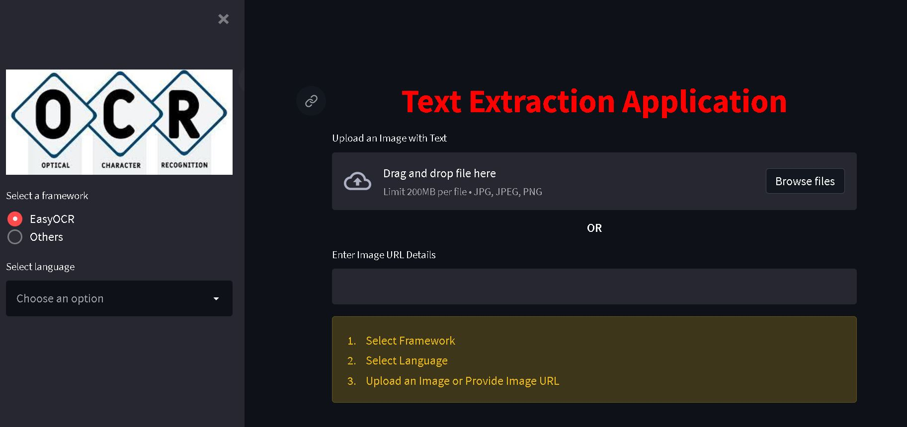
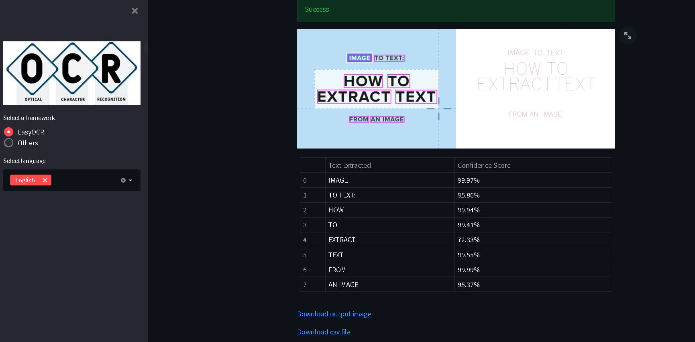

# TextExtractor
App to extract text from images

## Launch Deployed App

https://share.streamlit.io/jkcg-learning/textextractor/ocr_app.py

## How To Run App in Local

- Clone this repository

- streamlit run ocr_app.py

- Local URL: http://localhost:8501

## UI

- Select Framework
- Select Language
- Upload an Image or Enter Image URL
- Click on Extract Text Button

## Result

- Download the output image that identifies the text detected in a bounding box and the text recognised
- Download the csv file with text recognized and its confidence score

## Framework and Language Supported

- Framework - EasyOCR [updates with other frameworks soon]
- Languages - English, french, German , Dutch [updates with other language soon]
